<p style="text-align: center; font-family: 黑体; font-size: 24px;">本科实验报告</p>


<p style="text-align: left; font-family: 宋体; font-size: 16pt; line-height: 2; margin-left: 2em;white-space: nowrap">
    课程名称：  
    <span style="display: inline-flex; align-items: center; width: 60%; border-bottom: 1px solid black">
        <span style="text-align: center; width: 100%; white-space: nowrap;">B/S 体系软件设计</span>
    </span><br>
    姓  名：  
    <span style="display: inline-flex; align-items: center; width: 60%; border-bottom: 1px solid black;">
        <span style="text-align: center; width: 100%; white-space: nowrap;">金圣迪</span>
    </span><br>
    学  院：  
    <span style="display: inline-flex; align-items: center; width: 60%; border-bottom: 1px solid black;">
        <span style="text-align: center; width: 100%; white-space: nowrap;">计算机科学与技术学院</span>
    </span><br>
    &nbsp;&nbsp;&nbsp;系：&nbsp;&nbsp;
    <span style="display: inline-flex; align-items: center; width: 60%; border-bottom: 1px solid black;">
        <span style="text-align: center; width: 100%; white-space: nowrap;">计算机系</span>
    </span><br>
    专  业：  
    <span style="display: inline-flex; align-items: center; width: 60%; border-bottom: 1px solid black;">
        <span style="text-align: center; width: 100%; white-space: nowrap;">计算机科学与技术</span>
    </span><br>
    学  号：  
    <span style="display: inline-flex; align-items: center; width: 60%; border-bottom: 1px solid black;">
        <span style="text-align: center; width: 100%; white-space: nowrap;">3230103902</span>
    </span><br>
    指导老师：  
    <span style="display: inline-flex; align-items: center; width: 60%; border-bottom: 1px solid black;">
        <span style="text-align: center; width: 100%; white-space: nowrap;">胡晓军</span>
    </span><br>
</p>


<p style="text-align: center; font-family: 宋体; font-size: 18px;">2025 年 12 月 22 日</p> 


<div style="page-break-before: always;"></div>


<p style="text-align: center; font-family: 宋体; font-size: 24px;"><strong>浙江大学实验报告</strong></p>


<p style="text-align: left; font-family: 宋体; font-size: 14pt; line-height: 2; margin-left:0em;white-space: nowrap;line-height: 1.5;">
    课程名称：
    <span style="display: inline-block; width: 35%; border-bottom: 0.5px solid black; vertical-align: bottom; text-align: center;">
        B/S 体系软件设计
    </span>
    实验类型：
    <span style="display: inline-block; width: 35%; border-bottom: 0.5px solid black; vertical-align: bottom; text-align: center;">
        软件
    </span><br>
    实验项目名称：
    <span style="display: inline-block; width: 78%; border-bottom: 0.5px solid black; vertical-align: bottom; text-align: center;">
        图片管理网站 (Image Management Website)
    </span><br>
    学生姓名：
    <span style="display: inline-block; width: 21%; border-bottom: 0.5px solid black; vertical-align: baseline; text-align: center;">
        金圣迪
    </span>
    专业：
    <span style="display: inline-block; width: 24%; border-bottom: 0.5px solid black; vertical-align: baseline; text-align: center;">
        计算机科学与技术
    </span>
    学号：
    <span style="display: inline-block; width: 21%; border-bottom: 0.5px solid black; vertical-align: baseline; text-align: center;">
        3230103902
    </span><br>
    同组学生姓名：
    <span style="display: inline-block; width: 32%; border-bottom: 0.5px solid black; vertical-align: baseline; text-align: center;">
        &nbsp;
    </span>
    指导老师：
    <span style="display: inline-block; width: 34%; border-bottom: 0.5px solid black; vertical-align: baseline; text-align: center;">
        胡晓军
    </span><br>
    实验地点：
    <span style="display: inline-block; width: 35%; border-bottom: 0.5px solid black; vertical-align: baseline; text-align: center;">
        &nbsp;
    </span>
    实验日期：
    <span style="display: inline-block; width: 35%; border-bottom: 0.5px solid black; vertical-align: baseline; text-align: center;">
        2025 年 11 月 19 日
    </span><br>
</p>


## 摘要 <a id="sec-abstract"></a>

本实验实现了一个图片管理网站（Image Management Website），采用典型 B/S 架构：后端使用 Django + Django REST Framework 提供 REST API 与 Token 鉴权；前端使用 Vue 3 + Vite + Element Plus 实现登录/注册、图片上传、图片展示、标签管理与检索、轮播展示等功能。后端在图片上传入库时自动生成缩略图，并解析图片 EXIF 信息（拍摄时间、GPS 经纬度）与分辨率，同时以“自动 EXIF 标签”的方式写入标签表，便于后续检索与展示。

关键词：Django、DRF、Vue 3、Token Authentication、图片上传、缩略图、EXIF


## 目录 <a id="sec-toc"></a>

- [摘要](#sec-abstract)
- [1 项目概述](#sec-1)
- [2 需求分析](#sec-2)
- [3 设计文档（总体设计）](#sec-3)
- [4 详细设计（关键实现）](#sec-4)
- [5 使用手册](#sec-5)
- [6 测试报告](#sec-6)
- [7 开发体会](#sec-7)
- [8 小结](#sec-8)
- [附录：接口说明与部署说明](#sec-a)


<div style="page-break-before: always;"></div>

## 1. 项目概述 <a id="sec-1"></a>

### 1.1 项目名称

图片管理网站（Image Management Website）

### 1.2 项目目标

- 提供用户注册与登录能力（Token 鉴权）。
- 支持图片上传、列表展示与删除。
- 上传后自动生成缩略图，提高浏览效率。
- 自动解析 EXIF（拍摄时间、GPS）与分辨率，并在页面中展示。
- 支持为图片添加/编辑“自定义标签”，并支持按标签检索。
- 支持从已上传图片中选择轮播展示图片。

### 1.3 实现范围说明

- 已实现：登录/注册、Token 鉴权、图片上传/展示/删除、缩略图生成、EXIF 解析（时间、GPS）、分辨率解析、标签增删改查、图片标签编辑、按标签检索、轮播展示、AI 自动识别打标签。


## 2. 需求分析<a id="sec-2"></a>

### 2.1 功能性需求

1. 用户管理
    - 用户注册（用户名、邮箱、密码）。
    - 用户登录获取 Token。
2. 图片管理
    - 上传图片文件（支持多文件）。
    - 查看图片列表与图片详情（在列表中展示元信息）。
    - 删除图片。
3. 标签管理
    - 创建自定义标签，并与图片关联。
    - 编辑图片的自定义标签（对单张图片设置/更新）。
    - 按标签名进行模糊检索。
4. 自动元信息
    - 解析图片 EXIF（DateTimeOriginal、GPS）并写入字段。
    - 解析分辨率并写入字段。
    - 自动生成缩略图。
5. AI 智能标签
    - 集成通义千问（Qwen-VL）大模型，对图片内容进行智能分析。
    - 自动生成描述性标签（如“海边”、“夕阳”），并支持按 AI 标签检索。
6. 展示与交互
    - 网格化展示缩略图，点击可预览原图。
    - 轮播展示：从已有图片中多选轮播项。

### 2.2 非功能性需求

- 可用性：前端提供清晰的上传、检索、删除与标签编辑入口。
- 性能：列表优先加载缩略图（300x300），降低带宽占用。
- 安全性：接口基于 Token 进行鉴权；用户仅能访问自己的图片与标签。
- 可部署性：支持 Docker Compose 一键启动；本地开发可直接使用 SQLite。


## 3. 设计文档（总体设计）<a id="sec-3"></a>

### 3.1 技术选型

- 后端：Django 4.x + Django REST Framework
- 图片处理：Pillow
- 前端：Vue 3 + Vite + Element Plus + Axios
- 数据库：
  - Docker 环境：MySQL 8.0
  - 本地开发：SQLite（自动回退，减少环境成本）
- 容器化：Docker + docker-compose

### 3.2 系统架构

系统采用典型三层架构：

- 表现层：浏览器端（Vue 单页应用），通过 HTTP 调用后端 REST API。
- 业务层：Django/DRF 提供用户、图片、标签等资源的业务逻辑与鉴权控制。
- 数据层：MySQL/SQLite 存储用户、图片元信息与标签；媒体文件存储于后端 media 目录。

### 3.3 模块划分

1. 认证与用户模块
    - 注册：创建用户。
    - 登录：获取 Token。
2. 图片模块
    - 上传：保存原图文件与元数据；自动生成缩略图。
    - 查询：按用户隔离；按标签过滤。
    - 删除：删除数据库记录并清理文件。
3. 标签模块
    - 自定义标签：用于用户主动分类。
    - 自动 EXIF 标签：系统根据时间/地点/分辨率生成，作为可检索的结构化信息。
    - AI 智能标签：调用大模型生成的智能标签。
4. 前端展示模块
    - 上传组件、图库组件、轮播组件与检索控件。

### 3.4 数据设计（核心实体）

本项目核心实体包括：

- User：继承 AbstractUser，复用 Django 用户体系。
- Image：记录图片文件、缩略图、创建时间、EXIF 时间、GPS 位置、分辨率、AI 标签 JSON（存储原始 AI 响应）等。
- Tag：标签实体，包含 tag_name、tag_type（EXIF/Custom/AI）、user（标签归属用户）。
- Image-Tag：Image 与 Tag 多对多关联。

设计要点：

- 多用户隔离：图片与标签均绑定用户，接口查询默认按当前登录用户过滤。
- 自动 EXIF 标签：在图片创建后根据字段生成多层级时间标签与地点/分辨率标签，便于检索。

### 3.5 接口设计（资源与路由）

接口统一前缀为 `/api/`，采用 REST 资源风格。

- 认证
  - `POST /api/register/`：注册
  - `POST /api/login/`：登录获取 Token
- 图片
  - `GET /api/images/`：获取当前用户图片列表（支持 `tag` 与 `tag_id` 过滤）
  - `POST /api/images/`：上传图片（multipart/form-data）
  - `PATCH /api/images/{id}/`：编辑图片（本项目用于更新自定义标签）
  - `POST /api/images/{id}/ai_tag/`：生成 AI 标签
  - `DELETE /api/images/{id}/`：删除图片
- 标签
  - `GET /api/tags/`：获取当前用户标签
  - `POST /api/tags/`：创建标签
  - `PATCH /api/tags/{id}/`：更新标签
  - `DELETE /api/tags/{id}/`：删除标签

说明：媒体文件通过 `/media/` 暴露，在开发模式下由 Django 提供静态服务。


## 4. 详细设计（关键实现）<a id="sec-4"></a>

为避免篇幅过长，这个部分我仅展示说明关键代码。

### 4.1 后端关键实现

本节以我上传的 `backend/images/` 代码为准。

#### 4.1.1 图片上传与缩略图生成

- 图片文件保存：使用 Django `ImageField(upload_to='images/')` 存储原图。
- 缩略图生成：在图片首次保存后调用 Pillow 生成 300x300 缩略图，保存到 `thumbnails/`。
- 优点：前端列表加载缩略图，预览时再加载原图。

```python
# backend/images/models.py
class Image(models.Model):
    image = models.ImageField(upload_to='images/')
    thumbnail = models.ImageField(upload_to='thumbnails/', null=True, blank=True)

    def save(self, *args, **kwargs):
        creating = self._state.adding
        super().save(*args, **kwargs)
        if creating:
            self.process_image()
            super().save(update_fields=['thumbnail', 'exif_datetime', 'location', 'resolution'])
            self.apply_auto_exif_tags()
```

- 只在 `creating`（首次创建）时生成缩略图与解析 EXIF，避免每次修改标签都重复消耗 CPU。
- `super().save(update_fields=[...])` 只更新少数计算字段，减少 ORM 写入成本。

缩略图生成关键代码（Pillow）：

```python
# backend/images/models.py
img_copy = img.copy()
img_copy.thumbnail((300, 300))
if img_copy.mode in ('RGBA', 'P'):
    img_copy = img_copy.convert('RGB')
img_copy.save(thumb_io, format='JPEG')
self.thumbnail.save(thumb_name, ContentFile(thumb_io.getvalue()), save=False)
```

- 统一缩略图为 JPEG，且对带透明通道的图片做 `convert('RGB')`，避免保存 JPEG 失败。
- `save=False` 防止触发递归保存。

#### 4.1.2 EXIF 信息解析

- 拍摄时间：读取 EXIF 的 `DateTimeOriginal` 字段，解析为 `exif_datetime`。
- GPS 经纬度：读取 `GPSInfo` 并进行 DMS→十进制度转换，保存为 `location` 字符串（格式：`lat,lng`）。
- 分辨率：读取图片宽高，保存为 `resolution`（格式：`WxH`）。

DateTimeOriginal 关键代码：

```python
# backend/images/models.py
if tag_name == 'DateTimeOriginal':
    self.exif_datetime = datetime.strptime(str(value), '%Y:%m:%d %H:%M:%S')
```

关键代码（GPS DMS → 十进制度，并处理南/西半球符号）：

```python
# backend/images/models.py
def _dms_to_degrees(dms):
    degrees = _rational_to_float(dms[0])
    minutes = _rational_to_float(dms[1])
    seconds = _rational_to_float(dms[2])
    return degrees + (minutes / 60.0) + (seconds / 3600.0)

lat_ref = gps_data.get('GPSLatitudeRef')
lng_ref = gps_data.get('GPSLongitudeRef')
if lat_ref in ('S', 's'):
    lat = -lat
if lng_ref in ('W', 'w'):
    lng = -lng
```

- EXIF 的坐标常以有理数/分数表示，因此先做 `_rational_to_float` 兼容处理。
- 解析失败时整体采用容错策略（try/except），避免因个别图片 EXIF 不规范导致上传失败。

#### 4.1.3 自动 EXIF 标签策略

在图片创建后根据元信息生成 EXIF 类型标签：

- 时间标签：`时间:YYYY`、`时间:YYYY-MM`、`时间:YYYY-MM-DD`
- 地点标签：`地点:lat,lng`
- 分辨率标签：`分辨率:WxH`

这些标签与图片建立多对多关系，用于后续检索与展示。

关键代码（生成分层时间标签，便于粗粒度到细粒度检索）：

```python
# backend/images/models.py
if self.exif_datetime:
    auto_tag_names.extend([
        f"时间:{self.exif_datetime.strftime('%Y')}",
        f"时间:{self.exif_datetime.strftime('%Y-%m')}",
        f"时间:{self.exif_datetime.strftime('%Y-%m-%d')}",
    ])
```

- 同一张图片既可以按“年份”检索，也可以按“具体日期”检索。
- 自动标签类型设置为 `EXIF`，在前端展示时与用户自定义标签区分（避免信息重复）。

#### 4.1.4 权限与数据隔离

- 图片与标签接口均采用 `IsAuthenticatedOrReadOnly`。
- 查询时按 `request.user` 过滤，未登录返回空集合，避免数据泄露。
- 创建时在 `perform_create` 中强制将 `user` 绑定到当前登录用户。

关键代码（只返回当前用户数据 + 支持标签过滤）：

```python
# backend/images/views.py
def get_queryset(self):
    user = getattr(self.request, 'user', None)
    if user and user.is_authenticated:
        qs = Image.objects.filter(user=user).order_by('-created')
    else:
        qs = Image.objects.none()

    tag_id = self.request.query_params.get('tag_id')
    tag = self.request.query_params.get('tag')
    if tag_id:
        qs = qs.filter(tags__id=int(tag_id))
    if tag:
        qs = qs.filter(tags__tag_name__icontains=tag.strip())
    return qs.distinct()
```

- “未登录返回空集合”比“返回所有图片但前端隐藏”更安全。
- `distinct()` 避免多对多联表过滤造成的重复行。

#### 4.1.5 管理命令（便于演示与运维）

- `python manage.py init_admin`：创建默认管理员账号（admin / password）。
- `python manage.py sync_images`：扫描 `media/images`，将已有图片同步入库并生成缩略图。

关键代码（初始化管理员）：

```python
# backend/images/management/commands/init_admin.py
username = 'admin'
password = 'password'
User.objects.create_superuser(username, email, password)
```

- 创建默认管理员账号，也是方便演示。

关键代码（同步已有图片文件，触发同一套 `Image.save()` 处理逻辑）：

```python
# backend/images/management/commands/sync_images.py
img = Image(user=user)
img.image.name = f'images/{filename}'
img.save()  # triggers process_image & thumbnail
```

- `sync_images` 适合演示场景：把 `media/images` 文件夹中已有图片补录到数据库，避免手工逐张上传。

#### 4.1.6 序列化层：tag_names/tag_ids 的兼容设计（解决前端多种输入）

本项目既支持用 tag_id 绑定已有标签，也支持直接传入 tag_names 创建/绑定自定义标签。

关键代码（兼容 JSON 数组字符串 / 逗号分隔 / 原生数组）：

```python
# backend/images/serializers.py
class FlexibleStringListField(serializers.ListField):
    def to_internal_value(self, data):
        if isinstance(data, str):
            parsed = json.loads(data)  # if possible
            data = parsed if isinstance(parsed, list) else [t.strip() for t in data.split(',') if t.strip()]
        return super().to_internal_value(data)
```

关键代码（创建图片后，按 tag_names 创建/复用 Custom 标签并建立关联）：

```python
# backend/images/serializers.py
if tag_names and user and user.is_authenticated:
    cleaned = _normalize_tag_names(tag_names)
    for name in cleaned:
        existing = Tag.objects.filter(tag_name=name, tag_type='Custom', user=user).first()
        tags_to_add.append(existing or Tag.objects.create(tag_name=name, tag_type='Custom', user=user))
    image.tags.add(*tags_to_add)
```

关键代码（更新图片自定义标签：只替换 Custom，保留 EXIF 标签）：

```python
# backend/images/serializers.py
keep = list(instance.tags.exclude(tag_type='Custom', user=user))
instance.tags.set(keep + desired_custom)
```

- 这样做可以让自动 EXIF 标签始终存在且稳定，不会因为用户编辑自定义标签而被覆盖。
- 同时保证 Custom 标签按用户隔离（相同名字不同用户可各自拥有）。

#### 4.1.7 接口返回的图片 URL 处理（兼容移动端/代理）

由于开发时前端通过 Vite 代理访问后端，后端若返回 `http://127.0.0.1:8000/media/...` 这类绝对地址，手机访问时可能不可达（我在开发时遇到的问题，为了兼容手机端所以做出了修改），为此序列化层将图片链接转换为相对路径。

关键代码：

```python
# backend/images/serializers.py
for key in ('image', 'thumbnail'):
    v = rep.get(key)
    if isinstance(v, str) and v.startswith(('http://', 'https://')):
        rep[key] = urlparse(v).path or v
```

- 前端只需请求 `/media/...`，浏览器会自动使用当前站点域名，避免 127.0.0.1 只对本机可见的问题。

#### 4.1.8 AI 智能打标签（集成通义千问）

系统集成了阿里云通义千问（Qwen-VL）大模型，用于对图片内容进行智能分析并生成标签。

- 调用方式：使用 Python 标准库 `urllib` 调用通义千问的 OpenAI 兼容接口 (`compatible-mode`)，无需引入额外的 SDK 依赖。
- Prompt 设计：通过精心设计的 Prompt（提示词），要求 AI 分析图片内容并仅输出包含 1-8 个中文短词的 JSON 数组，例如 `["海边", "夕阳"]`。
- 错误处理：增加了对网络请求异常（如 400/500 错误）的详细捕获，确保在 API Key 无效或网络不通时能返回具体的错误信息给前端。
- 数据存储：生成的标签作为 `AI` 类型存储在 `Tag` 表中，同时将原始 JSON 响应存储在 `Image` 表的 `ai_tags_json` 字段中作为备份。

关键代码（调用 Qwen-VL）：

```python
# backend/images/ai.py
def _qwen_vision_tags(image_path: str) -> List[str]:
    # ... (读取配置与图片字节流)
    prompt = '请你分析这张图片内容，生成 1 到 8 个“标签”...'
    payload = {
        "model": "qwen-vl-max",
        "messages": [
            {
                "role": "user",
                "content": [
                    {"type": "text", "text": prompt},
                    {"type": "image_url", "image_url": {"url": f"data:{mime_type};base64,{b64}"}}
                ]
            }
        ]
    }
    # ... (发送 HTTP POST 请求并解析 JSON)
```

### 4.2 前端关键实现

本节以我上传代码中的 `frontend/src/` 为准，说明前端如何组织状态与调用后端接口。

#### 4.2.1 登录/注册

- 注册：调用 `/api/register/` 创建用户。
- 登录：调用 `/api/login/` 获取 Token，并写入 localStorage；后续请求在 Header 中携带 `Authorization: Token <token>`。

关键逻辑：

- Token/用户名存入 localStorage，刷新后可保持登录态。
- axios 请求统一携带 `Authorization` 头。

#### 4.2.2 上传、展示与预览

- 上传：使用 Element Plus 的拖拽上传组件，选择文件后并发发起多次上传请求。
- 展示：网格化卡片展示缩略图；点击缩略图可预览原图。

关键代码（上传时携带 tag_names，后端可直接创建/绑定自定义标签）：

```javascript
// frontend/src/components/ImageUpload.vue
const form = new FormData()
form.append('image', file.raw)
form.append('tag_names', JSON.stringify(cleaned))
await axios.post(`${API}/images/`, form, {
    headers: { 'Content-Type': 'multipart/form-data', 'Authorization': `Token ${this.token}` }
})
```

关键代码（列表使用缩略图，点击预览使用原图）：

```vue
<!-- frontend/src/components/Gallery.vue -->
<el-image
    :src="getFullUrl(item.thumbnail || item.image)"
    :preview-src-list="[getFullUrl(item.image)]"
    fit="cover"
/>
```

#### 4.2.3 自定义标签与检索

- 上传时可填写自定义标签（多选/可输入），随表单字段 `tag_names` 提交。
- 图库中可对单张图片编辑自定义标签（保存时 PATCH 图片资源）。
- 检索：按标签名模糊检索（对应后端 `tag` query param）。

关键代码（检索：把标签关键字作为 query 参数发送到后端）：

```javascript
// frontend/src/components/Gallery.vue
const params = {}
if (this.filterTag && String(this.filterTag).trim()) {
    params.tag = String(this.filterTag).trim()
}
await axios.get(`${API}/images/`, { headers: { Authorization: `Token ${this.token}` }, params })
```

关键代码（编辑标签：PATCH 图片资源，仅更新自定义标签）：

```javascript
// frontend/src/components/Gallery.vue
const form = new FormData()
form.append('tag_names', JSON.stringify(cleaned))
await axios.patch(`${API}/images/${item.id}/`, form, { headers: { Authorization: `Token ${this.token}` } })
```

- 使用 `allow-create + multiple` 让用户既能选择已有标签，又能快速输入新标签。
- 后端更新策略是保留 EXIF，仅替换 Custom，因此不会出现自动标签被误删。

#### 4.2.4 轮播展示

- 从当前已加载图片中多选轮播项。
- 轮播选择结果存储于 localStorage（仅前端状态），刷新页面仍可保持。

关键代码（用 localStorage 持久化轮播选择）：

```javascript
// frontend/src/App.vue
watch: {
    carouselSelectedIds: {
        deep: true,
        handler(v) {
            localStorage.setItem('carousel_selected_ids', JSON.stringify(v || []))
        }
    }
}
```

#### 4.2.5 Vite 代理与静态媒体访问

开发模式下，前端通过代理把 `/api` 与 `/media` 转发到后端，避免跨域与端口问题。

关键配置：

```javascript
// frontend/vite.config.js
proxy: {
    '/api': { target: 'http://127.0.0.1:8000', changeOrigin: true },
    '/media': { target: 'http://127.0.0.1:8000', changeOrigin: true }
}
```


## 5. 使用手册<a id="sec-5"></a>

### 5.1 运行方式

#### 5.1.1 运行方式一：Docker Compose（推荐）

在项目根目录执行：

```bash
docker-compose up --build
```

启动后：

- 后端：`http://localhost:8000`
- 前端：`http://localhost:5173`

#### 5.1.2 运行方式二：本地开发（后端 + 前端）

1) 后端（Windows PowerShell 示例）：

```bash
cd backend
python manage.py makemigrations && python manage.py migrate
python manage.py init_admin # 初始化管理员
python manage.py runserver 0.0.0.0:8000
```

2) 前端：

```bash
cd frontend
npm install
npm run dev
```

### 5.2 基本使用流程

1. 注册账号（或直接使用默认管理员账号）

   默认管理员：用户名 `admin`，密码 `password`。

2. 登录

   登录成功后页面会显示 Token 登录状态，并展示上传区、轮播区与图库。

3) 上传图片
   - 拖拽或点击选择多张图片。
   - 可填写自定义标签（可多选、可输入）。
   - 点击“开始上传”。上传完成后图库自动刷新。

4) 查看图片信息

   每张图片卡片会展示：

   - 自定义标签（仅展示 Custom 类型）
   - AI 智能标签（展示 AI 类型，由通义千问生成）
   - 拍摄时间（若无 EXIF 则显示上传时间）
   - 地点（EXIF GPS 解析结果，大部分图片都不会包含定位，所以大多数情况都为空，即不显示地点）
   - 分辨率

5. AI 智能打标

   在图片卡片下方点击绿色“AI”按钮，系统将调用通义千问大模型分析图片内容，并自动添加如“海边”、“夕阳”等描述性标签。

6. 编辑自定义标签

   在图片卡片下方选择/输入标签，点击“保存”。

7. 按标签检索

   在“按标签检索”输入框输入标签关键字（支持自定义标签、AI 标签、自动 EXIF 标签）并检索，图库会按标签过滤。

8. 轮播展示

   点击“编辑轮播”，多选图片 ID，点击保存。

9. 删除图片

   点击图片卡片右侧删除按钮，确认后删除。

### 5.3 常见问题

- 登录后仍无法加载图片：确认 Token 已写入并随请求发送；必要时退出重新登录。
- 手机访问无法加载图片：前端通过 Vite 代理 `/media` 与 `/api`，建议使用同一局域网 IP 访问前端，或将后端服务暴露在可访问地址。建议手机端开启热点，电脑连接手机热点，然后重启前端后再访问对应 IP 地址。


## 6. 测试报告<a id="sec-6"></a>

这里的测试部分根据使用手册中的 [基本使用流程](#5.2 基本使用流程) 章节的流程进行测试。

1. 注册账号（或直接使用默认管理员账号）

   根据提示注册账号。

   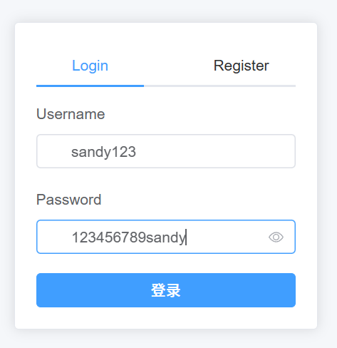

   注册成功后会自动跳转登录。为了方便演示，我使用管理员账号登陆，而不是用这个账号。

2. 登录

   登录成功后页面会显示 Token 登录状态，并展示上传区、轮播区与图库。

   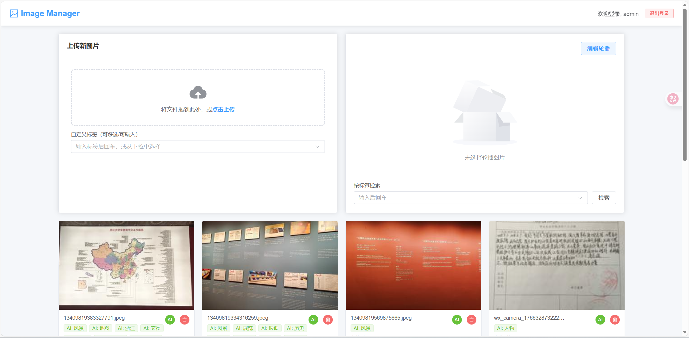

3. 上传图片

   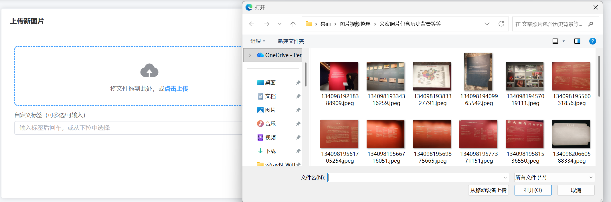

   可以上传本地图片。

4. 查看图片信息

   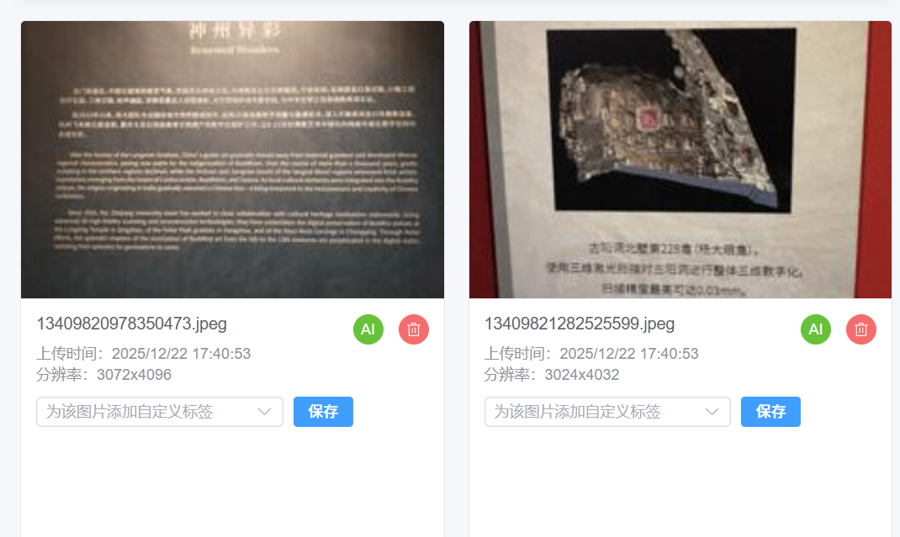

   新上传的图片显示信息如上所示。

5. AI 智能打标

   点击“AI”按钮，查看生成的标签。

   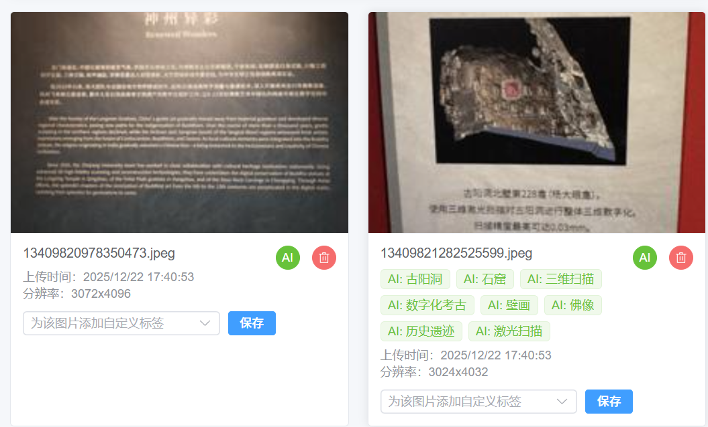

6. 编辑自定义标签

   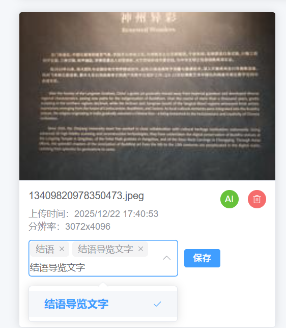

   添加自定义标签。

   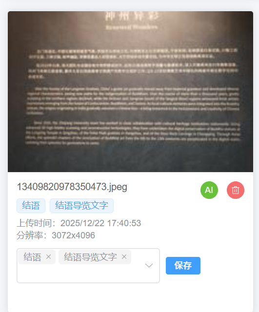

7. 按标签检索

   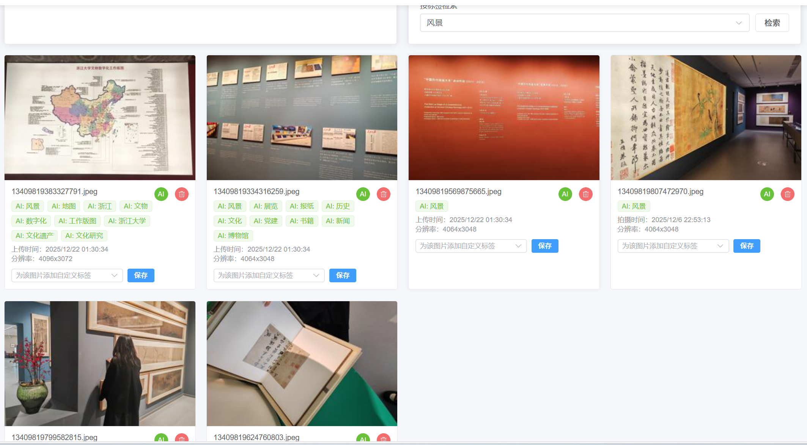

   按“风景”检索，得到结果。

8. 轮播展示

   点击“编辑轮播”，多选图片 ID。

   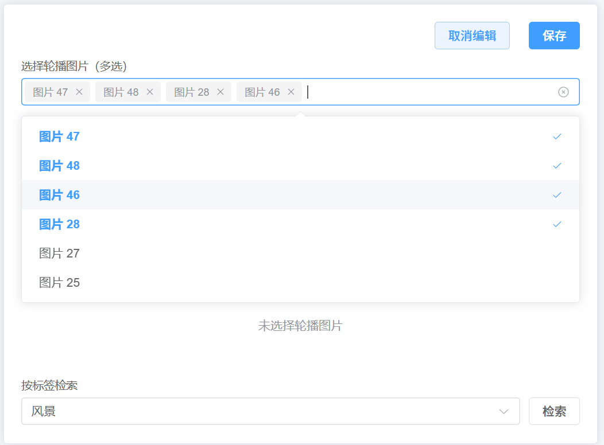

   保存后可以查看轮播功能。

   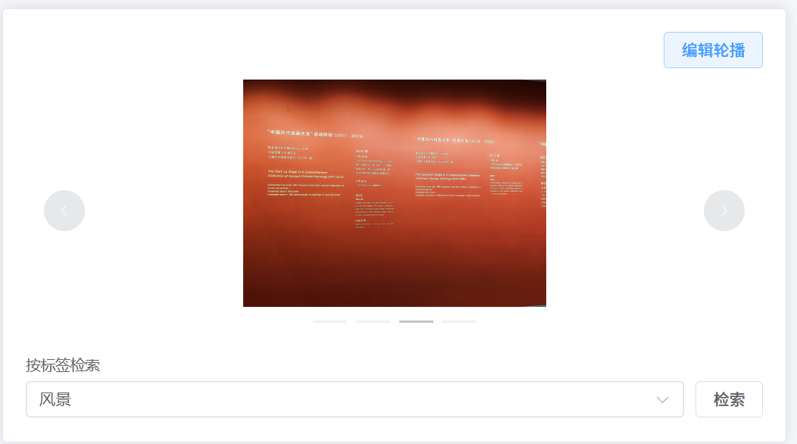

9. 删除图片

   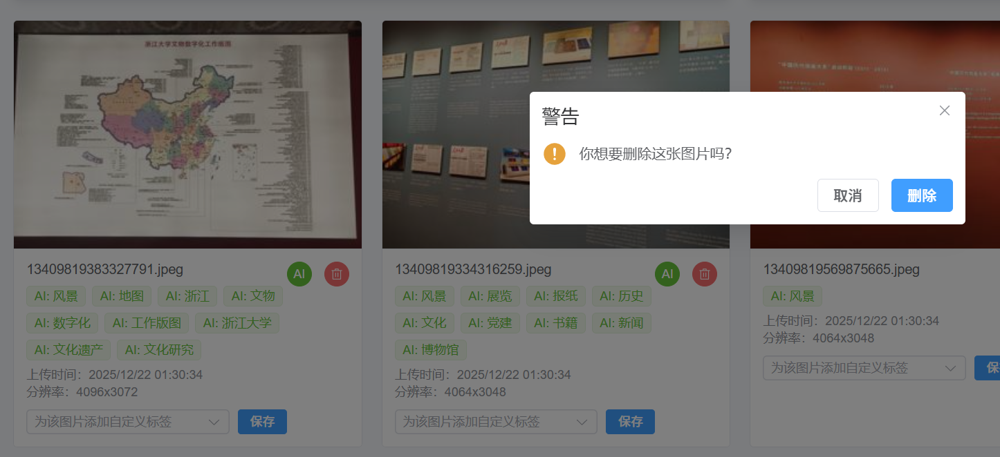

   删除第一张图片。

   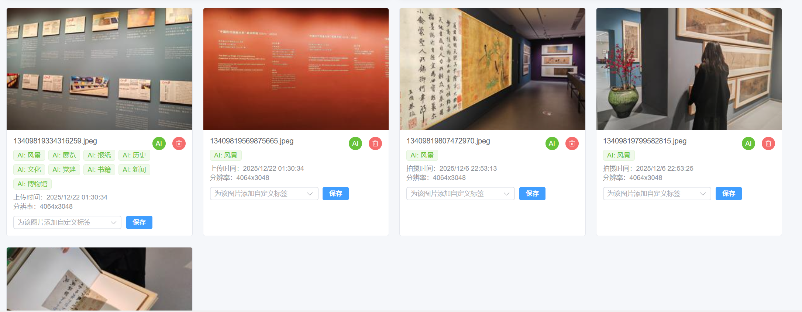

   删除成功。

10. 移动端适配

   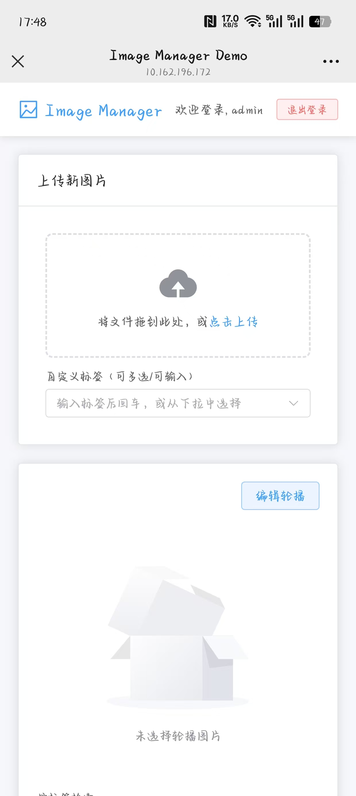

   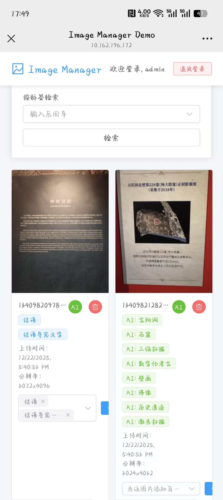

   可以正常使用。

以上是所有的测试，所有功能均可使用。

## 7. 开发体会 <a id="sec-7"></a>

本项目从能跑起来到可用，经历了一个很漫长的周期，各种而各样的坑都被我踩到了，主要集中在前后端联调、图片处理兼容性、以及多端访问的网络与 URL 细节上。这些基本都是血与泪的教训。

比较严重的问题就是手机端无法正常登录，一直会报错无法连接到服务器。排查发现是手机无法链接到后端的端口（虽然我也不知道为什么，我明明增加了防火墙的端口输入的规则，但还是不行），然后我就尝试使用 vite 进行代理。经过代理之后，能够正常登录了，但是无法加载图片。在电脑端通过前端页面可正常查看图片，但用手机访问前端页面时，图片会加载失败。排查发现后端返回的图片/缩略图字段有时是 `http://127.0.0.1:8000/media/...` 形式的绝对地址，手机请求到的是自己本机的 127.0.0.1，所以会无法访问电脑后端。因此，我在序列化层对返回值做“绝对 URL $\rightarrow$ 相对路径”转换，让前端始终请求 `/media/...`；同时在 Vite 中配置 `/api` 与 `/media` 代理，保证开发模式下同源访问。最后也是成功解决了这个问题，这让我意识到，接口返回应尽量与部署拓扑解耦。对客户端而言，相对路径 + 同源往往比写死 host 的绝对 URL 更稳健。

还有标签输入格式混乱（数组/字符串/逗号分隔）的问题。前端使用 `el-select` 的 `multiple + allow-create`，并通过 FormData 提交；在不同浏览器与调试过程中，`tag_names` 可能出现 JSON 数组字符串、普通字符串、或逗号分隔字符串等多种形态，导致后端解析不稳定、出现空标签或重复标签。这其实很影响美观，所以我就在后端实现了更宽容的解析字段（既能接受原生数组，也能接受 JSON 数组字符串与逗号分隔），并对标签做清洗去重；同时在更新标签时，只替换 Custom 标签、保留 EXIF 标签，避免用户编辑把系统自动标签覆盖掉。虽然只是一个小小的标签，但我也因此也改了好久。

还有EXIF 信息不稳定的问题。其实大部分网络图片没有 GPS 信息，而且部分图片的 EXIF 字段缺失或格式不规范，解析日期与坐标时容易抛异常，影响上传成功率。因此，我在 EXIF 解析时采用大量 try/except 监测是否产生错误，并对错误情况进行输出，同时对 GPS 坐标按有理数/分数进行兼容转换（DMS→十进制度）；前端展示时若无 `exif_datetime` 则回退显示上传时间。

我最后还增加了数据隔离与权限控制，主要是为了避免访问到他人数据。我感觉图片与标签应该是用户私有数据，每个人应该只能访问自己上传的图片，因此要对查询接口加限制，不然会出现登录后能看到别人图片/标签的问题。所以我增加了查询集严格按 `request.user` 过滤的规则，同时未登录返回空集合，创建时强制绑定当前用户，并在序列化层限制 `tag_ids` 只能选择当前用户的标签，避免跨用户关联。

其实除了上述说到的这些问题之外，还有许多小问题。开发一个这样的项目并不是一件很容易的事情，我在开发过程中碰到的一些问题，都会使用到 Edge 浏览器和 ai 查询解决。也是非常感激这个大作业，让我因此学到了许多，对前后端有了更深层次的了解。

在项目后期，我尝试引入了 AI 能力，对接了通义千问的大模型 API。这个过程让我体会到了将传统 Web 应用与现代 AI 服务结合的魅力。虽然只是简单的图像打标，但它极大地提升了图片管理的智能化水平，让“按内容检索”成为了可能，而不仅仅局限于用户手动输入的标签或元数据。这也让我对未来的软件开发有了更多的思考，AI 能力的集成将成为应用开发的重要趋势。


## 8. 小结 <a id="sec-8"></a>

本项目最终实现了一个可部署、可演示、可实际使用的图片管理网站（Image Management Website）。系统采用典型的前后端分离 B/S 架构：后端基于 Django + Django REST Framework 提供 REST API 与 Token 鉴权；前端基于 Vue 3 + Vite + Element Plus 实现交互界面。整体上已经完成了用户认证 → 图片上传 → 自动处理（缩略图/EXIF/AI打标）→ 标签管理与检索 → 图片展示与删除的完整业务闭环。

项目最终成果可概括为：

- 功能层面：注册/登录、Token 鉴权、图片多文件上传、缩略图生成、EXIF（拍摄时间/GPS）与分辨率解析、AI 智能内容分析与打标、图片列表展示与预览、图片删除、自定义标签增删改查、按标签检索、轮播展示与前端持久化选择。
- 工程层面：提供 Docker Compose 一键启动方案，同时兼顾本地开发体验（无 MySQL 环境时自动回退到 SQLite）；提供 `init_admin` 与 `sync_images` 等脚本降低演示成本。

未来改进方向：

- 功能扩展：补充在线编辑、批量操作、更多检索维度（时间范围/分辨率筛选/EXIF 地图展示）、LLM 对话式检索。
- 体验与性能：引入分页/懒加载、后台异步任务处理大图与缩略图、优化移动端访问与部署配置。
- 智能化：在已有标签体系上扩展 AI 自动打标与更自然的检索方式（如语义检索）。


## 附录：接口说明与部署说明 <a id="sec-a"></a>

### A.1 接口字段与示例

1) 登录获取 Token
   - 请求：`POST /api/login/`，参数：`username`、`password`
   - 响应：`{"token": "..."}`

2. 上传图片

   请求：`POST /api/images/`（multipart/form-data）

   - `image`: 文件
   - `tag_names`: JSON 数组字符串，如 `[]` 或 `["风景","旅行"]`

3. 获取图片列表（按标签过滤）

   `GET /api/images/?tag=风景`

### A.2 部署说明

- Docker 环境下数据库为 MySQL；本地无 MySQL 环境时自动使用 SQLite。

- 媒体文件目录为 `backend/media/`，其中 `images/` 存放原图，`thumbnails/` 存放缩略图。

- 在后端根目录下需要完善 `.env` 文件，加入自己的通义千问 api，可以通过复制完善 `.env.example` 得到。或者在后端的 `config` 文件夹中增加文件 `app_config.json` ，内容如下：

  ```json
  {
    "AI_TAGGING_PROVIDER": "qwen",
  
    "AI_VISION_API_KEY": "api-key",
    "AI_VISION_MODEL": "qwen-vl-max",
    "AI_VISION_BASE_URL": "https://dashscope.aliyuncs.com/compatible-mode/v1/chat/completions",
    "HTTPS_PROXY": ""
  }
  ```

  


